[](https://classroom.github.com/a/YFgwt0yY)
# MiniTorch Module 2


* Docs: https://minitorch.github.io/

* Overview: https://minitorch.github.io/module2/module2/

This assignment requires the following files from the previous assignments. You can get these by running

```bash
python sync_previous_module.py previous-module-dir current-module-dir
```

The files that will be synced are:

        minitorch/operators.py minitorch/module.py minitorch/autodiff.py minitorch/scalar.py minitorch/scalar_functions.py minitorch/module.py project/run_manual.py project/run_scalar.py project/datasets.py

# Model Training Results

This project contains the training results for four main datasets. For each dataset, a scalar model was trained, and the output training logs and final images are provided below.

## Datasets and Results


### 1. **Simple Dataset (simple)**
   - **Time Per Epoch** Time per epoch: 0.151s
   - **Training Log:** [simpleDataLog.txt](results/simpleDataLog.txt)
   - **Final Images:**
     - 
     - 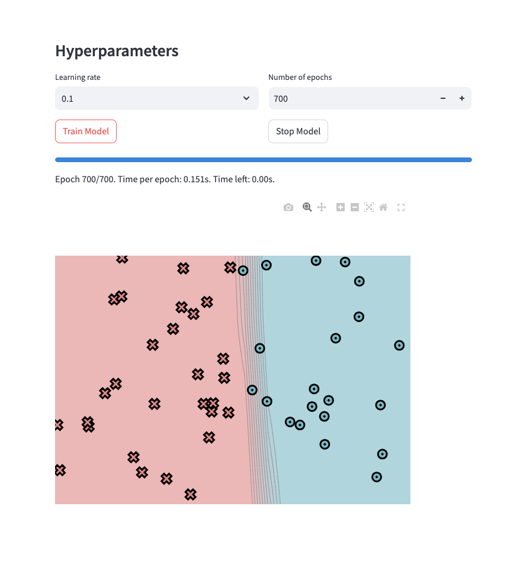
     - 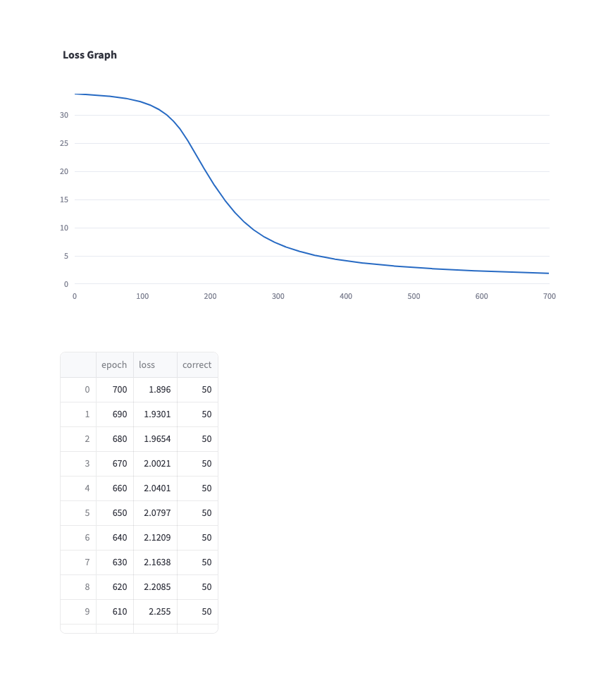

### 2. **Diagonal Dataset (diag)**
   - **Time Per Epoch** Time per epoch: 0.140s
   - **Training Log:** [diagLog.txt](results/diagLog.txt)
   - **Final Images:**
     - 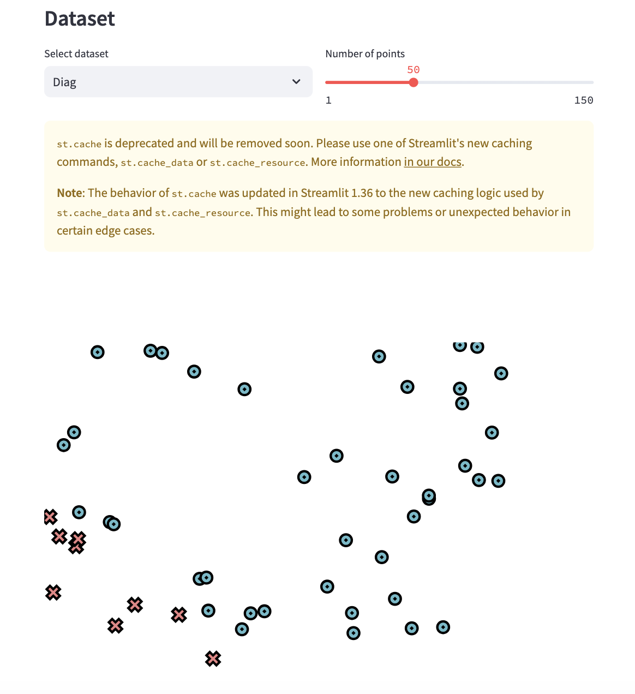
     - 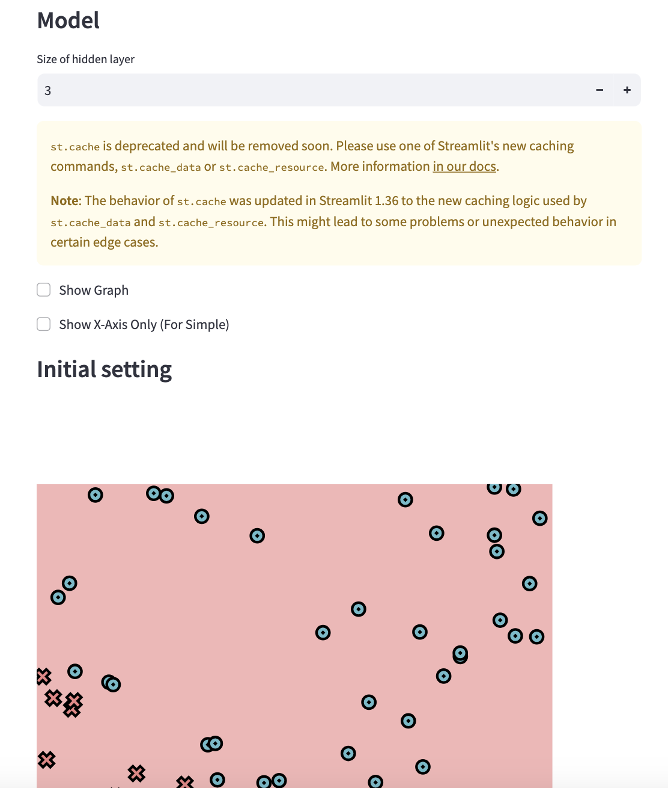
     - 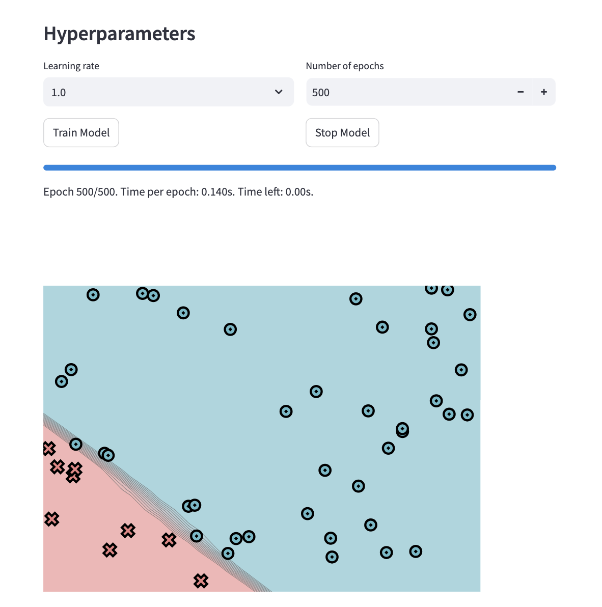
     - 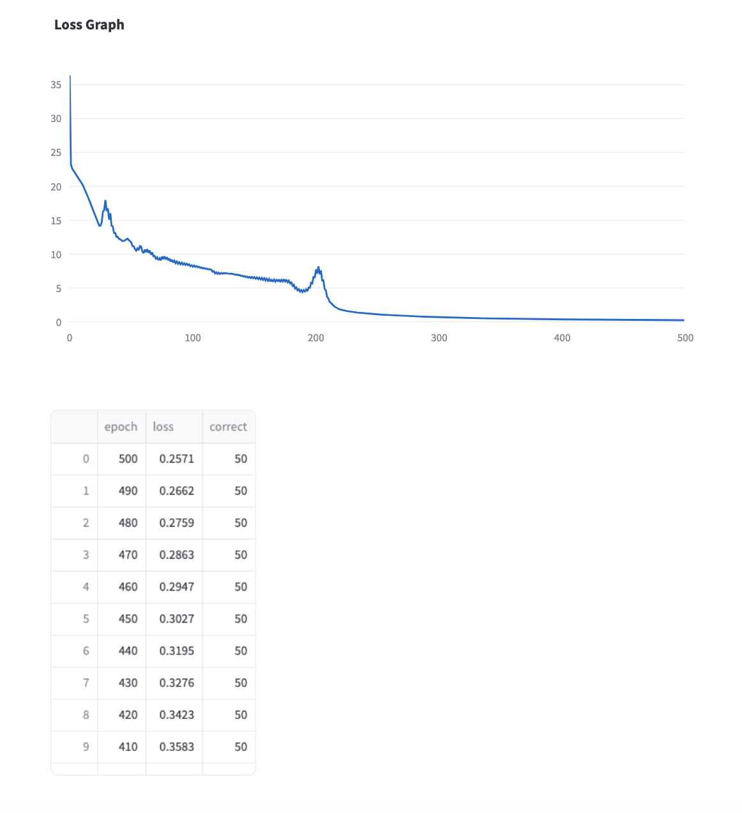

### 3. **Split Dataset (split)**
   - **Time Per Epoch** Time per epoch: 0.393s
   - **Training Log:** [splitLog.txt](results/splitLog.txt)
   - **Final Images:**
     - 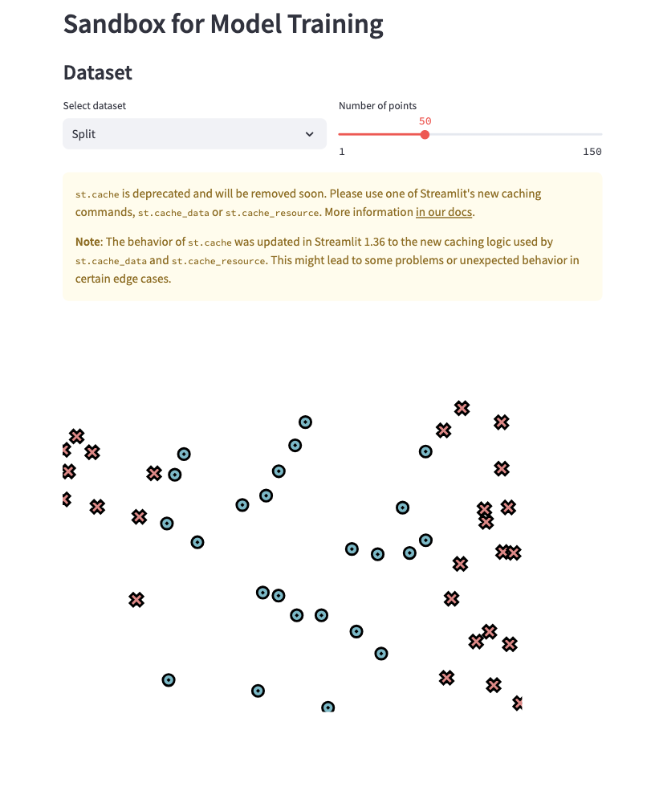
     - 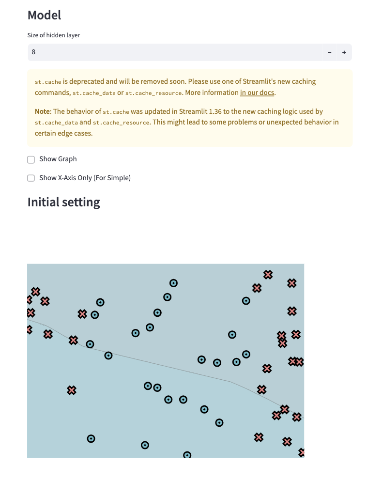
     - 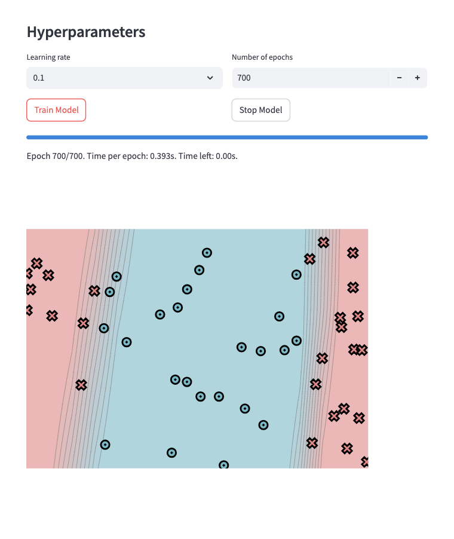
     - 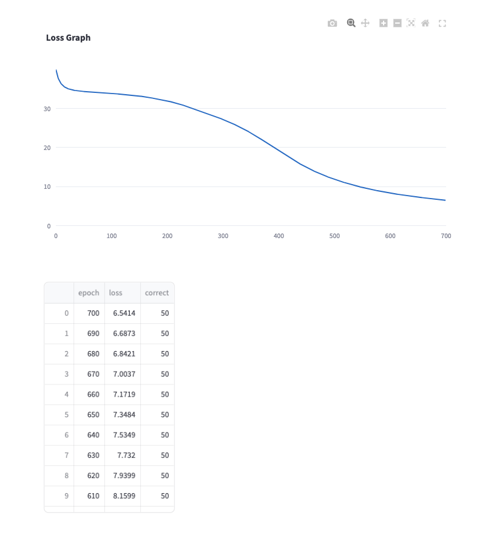

### 4. **XOR Dataset (xor)**
   - **Training Log:** [xorLog.txt](results/xorLog.txt)
   - **Final Images:**
     - 
     <!-- - 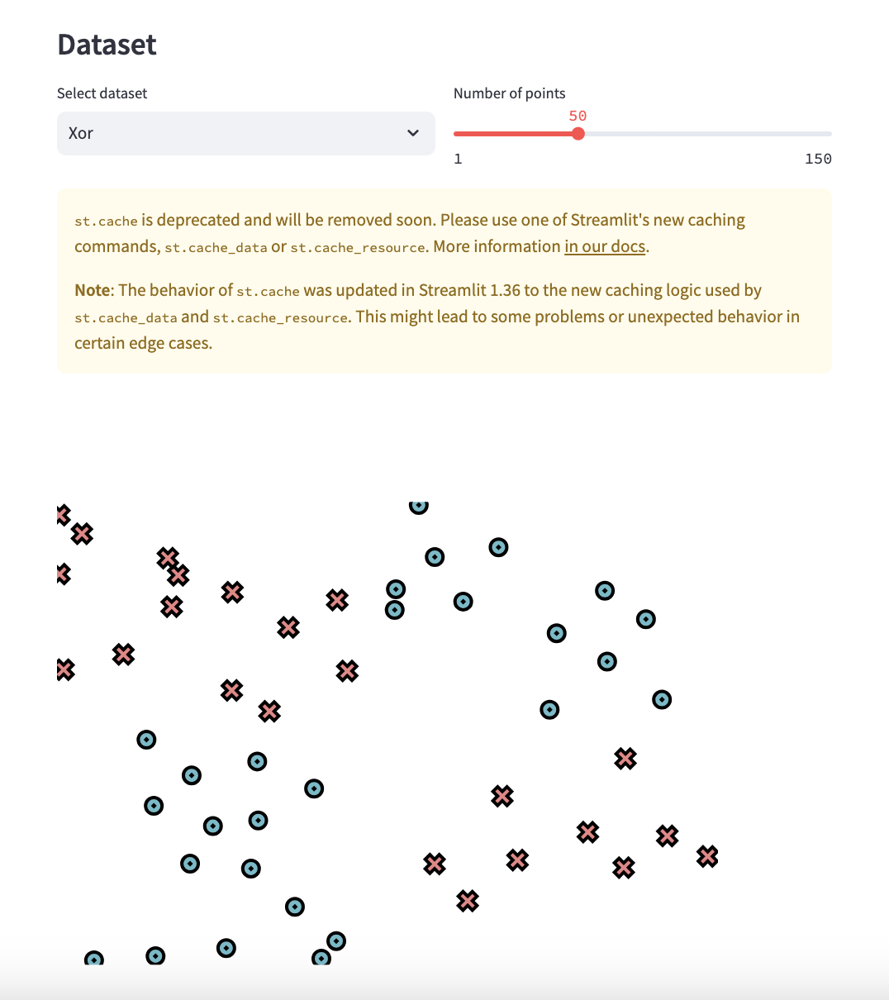
     - 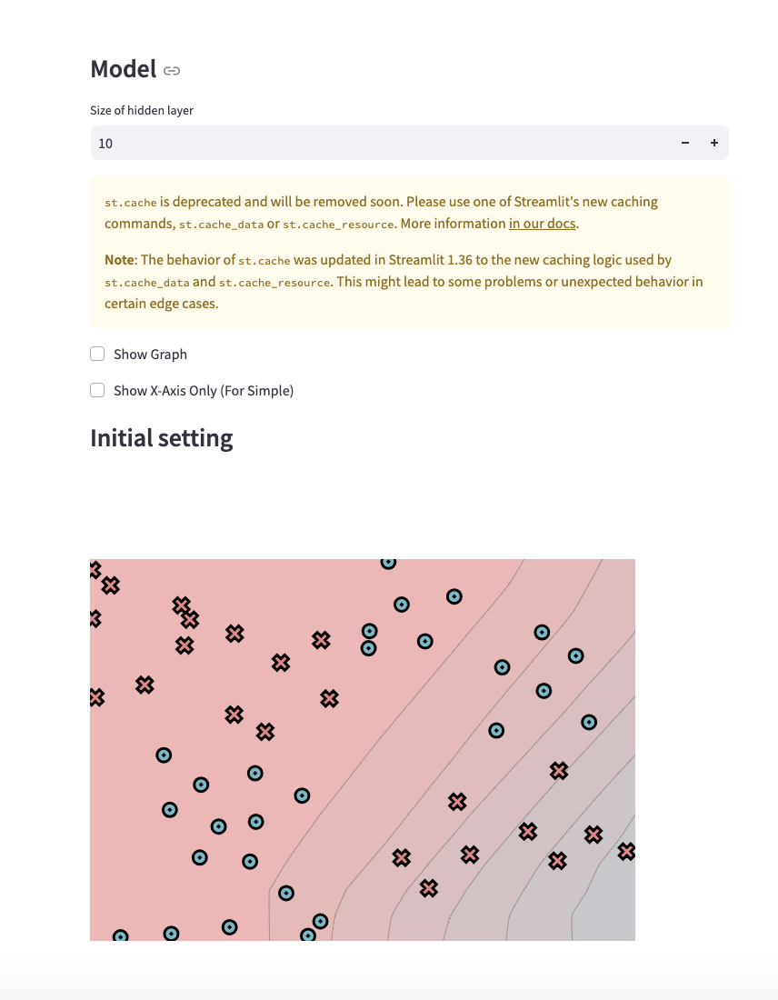 -->